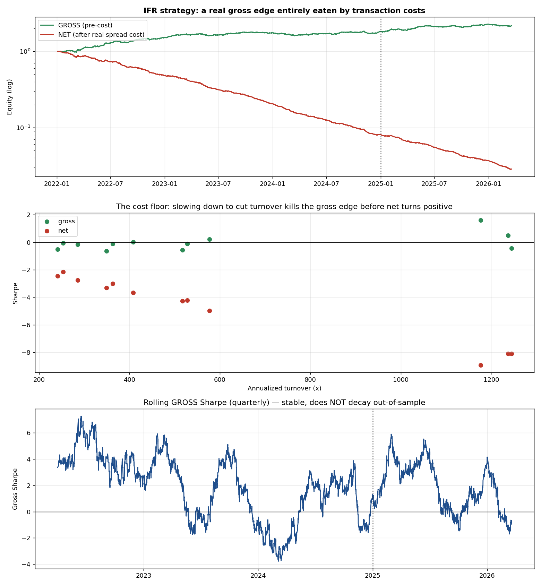

# The Alpha Decay — Market Regime Change (Capstone)

A quantitative research capstone on **alpha decay**: what happens when a statistical-arbitrage
strategy's edge stops existing, how to *diagnose* it rigorously, and how to avoid fooling yourself
with backtest artifacts. The project's defining principle is **intellectual honesty** — every
positive-looking result is put through a kill-test gate, and the ones that fail are retracted in
writing rather than quietly kept.

> **Note on scope:** This repository publishes the **research output** — analysis reports, decision
> memos, figures, the strategy specification, and a full claims-vs-evidence audit. The **source code
> and datasets are intentionally withheld.** The goal is to show the *quality of reasoning*, not to
> ship a runnable, copyable strategy.

---

## The arc (and the honest punchline)

The project starts from one decaying daily pairs bot, proves *why* it died, searches the universe for
a robust replacement under snooping-free discipline, audits its own data and code for bugs, then
graduates to an intraday factor-residual strategy that uses the full order book.

**The honest result: no fundable edge survives — but for two *different* reasons,** which is the
whole lesson of "nothing lasts forever":

| | Daily pairs (NVDA/TSLA) | Intraday residual (IFR) |
|---|---|---|
| Apparent edge | weak | strong-looking (Sharpe 1.6) |
| Why it isn't real | relationship **decayed** out-of-sample | **bid-ask bounce**, dies on a 1-bar lag |
| Fundable? | **No** | **No** |

Proving the *absence* of a capturable edge — cleanly, and resisting the temptation to tune until
something looks fundable — is the actual deliverable.

## What's inside

| Document | What it shows |
|---|---|
| [Decay Analysis Report](reports/decay_analysis_report.md) | Rolling-Sharpe decay + cointegration / structural-break diagnosis of the NVDA/TSLA bot |
| [Decision Memo](reports/decision_memo.md) | The tweak-vs-decommission call, in PM voice |
| [Pair Scan v2](reports/pair_scan_v2.md) | Snooping-free universe search (113k → 0 fundable pairs) |
| [Regime-Aware Bot](reports/regime_bot.md) | Conviction sizing + kill-switch — and its honest limits |
| [Intraday Strategy (IFR)](reports/intraday_strategy_report.md) | Factor-residual stat-arb + the de-bounce test that kills the apparent edge |
| [**Validation Ledger**](reports/VALIDATION_LEDGER.md) | **Every headline claim re-stated against a 9-point kill-test checklist** |
| [Strategy Spec](STRATEGY_SPEC.md) | Formal design of the intraday factor-residual strategy |
| [Implementation Plan](IMPLEMENTATION_PLAN.md) | Full system architecture and build phases |

## Methodological rigor on display
- **Out-of-sample discipline** — selection never touches the hold-out (a v1 scan that violated this is documented as a *retracted* false positive).
- **Deflated Sharpe Ratio + purged walk-forward** — significance corrected for multiple testing.
- **Microstructure de-bounce test** — distinguishes real reversion from uncapturable bid-ask bounce.
- **Self-audit** — found and fixed a real data bug (split-adjuster mis-classifying earnings crashes), and quantified an unhedged net-beta exposure in the "neutral" book.
- **Realistic costs** — backtests charge actual L1 order-book half-spreads, not a flat proxy.

## Figures

---
*Stack: Python (pandas, NumPy, statsmodels, SciPy, matplotlib) over L1–L3 order-book data, 2022–2026.
Source and data withheld by design.*
