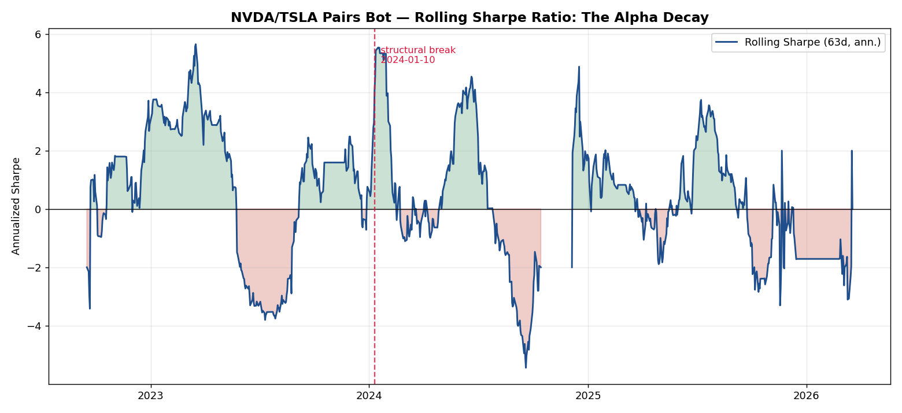
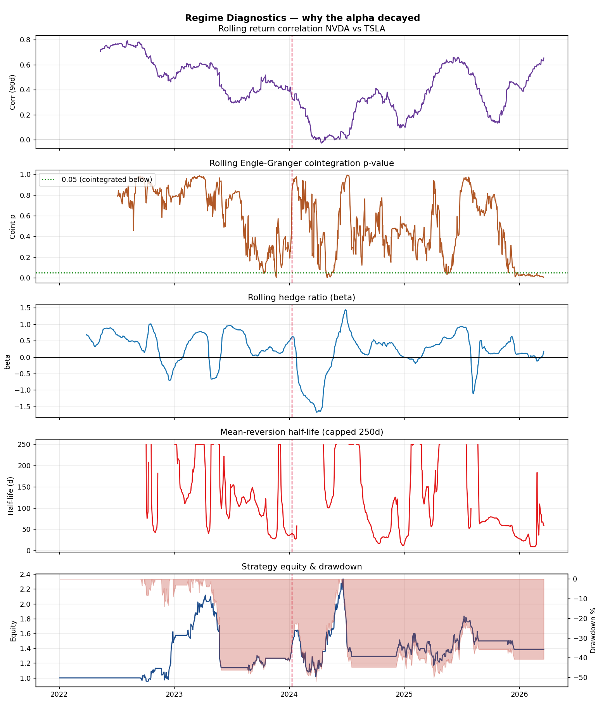

# Decay Analysis Report — NVDA/TSLA Statistical-Arbitrage Bot
**Author:** Quant Research (Statistical Arbitrage desk) · **Date:** 2026-05-29
**Sample:** 2022-01-03 → 2026-03-19 (1,056 trading days) · **Source:** L1 order-book mids, split-adjusted

---

## 1. Executive summary

The NVDA/TSLA mean-reversion pairs bot **has decayed and should be decommissioned.** The strategy
returned **+38.5% gross-of-fees over the full sample but a full-sample Sharpe of only 0.40**, and
essentially **all of that P&L was earned in 2022–early 2023.** Since then it has produced a **−52%
maximum drawdown** and a rolling Sharpe that now sits at **~0.0**.

The deeper finding is structural: **this pair was never a true cointegrated relationship.** The
rolling Engle-Granger cointegration p-value averaged **0.67 before** and **0.44 after** the break —
never durably below the 0.05 threshold. The "edge" was really **shared AI/growth beta**: the two
names co-moved (return correlation **0.68 in 2022**) until that link halved to **0.42 by 2025** as
NVDA (AI/datacenter) structurally decoupled from TSLA (EV/autonomy + regulation). A Chow test dates
the regime break to **2024-01-10 (F = 2,518)**. You cannot re-parameterize a cointegration that the
market regime no longer supplies.

---

## 2. The bot under review

| Component | Specification |
|---|---|
| Universe | NVDA vs TSLA, daily RTH closes from L1 mids |
| Hedge ratio β | 60-day rolling OLS of log(NVDA) on log(TSLA) |
| Spread | `s = log(NVDA) − β·log(TSLA)` |
| Signal | z-score of spread over 60 days |
| Rules | enter `|z|>2.0`, exit `|z|<0.5`, hard stop `|z|>3.5` |
| Costs | real L1 half-spread charged on both legs at every rebalance |
| Execution | positions lagged one day (no lookahead) |

## 3. Headline performance

| Metric | Value |
|---|---|
| Total net return | **+38.5%** |
| Full-sample Sharpe | **0.40** |
| Max drawdown | **−52.0%** |
| Trades | 38 |
| Rolling Sharpe (latest) | **~0.0** |

**Performance by year** — the decay is unmistakable once you decompose it:

| Year | Sharpe | Return |
|---|---|---|
| 2022 | **1.48** | +49.7% |
| 2023 | −0.21 | −15.2% |
| 2024 | 0.47 | +11.7% |
| 2025 | 0.14 | −2.3% |
| 2026 (to Mar) | n/a | ~0% (no tradable signal) |

The bot's entire reputation rests on 2022. Every year since has been flat-to-negative, with
intermittent revivals (mid-2024, early-2025) that are **regime luck, not durable edge.**

## 4. The decay, visualized

**Figure 1 — Rolling Sharpe (63-day, annualized).** The positive (green) episodes shrink in
amplitude and frequency through the sample while negative (red) episodes deepen; the series
terminates at ~0. This is the signature of an edge bleeding out, not a temporary slump.

**Figure 2 — Regime diagnostics (the *why*).**
- **Rolling correlation** falls from ~0.68 (2022) to ~0.42 (2025+) — the co-movement that powered the trade is going away.
- **Cointegration p-value** sits mostly at 0.4–1.0 and only rarely dips under 0.05 — there was never a stable long-run equilibrium to revert to.
- **Hedge ratio β** is unstable, swinging from +1.5 to **−1.5** around the 2024 break; a negative β means the "hedge" leg flips to a second long — the model is no longer describing a real relationship.
- **Mean-reversion half-life** is persistently long (averaging 150–220 days, frequently capped) — far too slow for a 60-day signal to harvest.
- **Equity & drawdown** peaks in early 2023, then a multi-year, ~52% drawdown — the capital-curve confirmation that the alpha stopped compounding three years ago.

## 5. Tweak-vs-decommission diagnosis

| Signal | Reading | Verdict |
|---|---|---|
| Cointegration p-value | 0.67 → 0.44, never durably < 0.05 | **Structural** — no equilibrium to recalibrate to |
| Hedge ratio β | unstable, flips negative at the break | **Structural** — relationship is non-stationary |
| Half-life | 150–220 d, slower than the signal | **Structural** — mechanism too slow to monetize |
| Rolling Sharpe | terminal ~0, shrinking positive episodes | **Decayed** |
| Correlation | 0.68 → 0.42 | **Regime change** (AI vs EV divergence) |

Every diagnostic points to a **structural break, not parameter drift.** Parameter drift would show a
*stable* β at a new level and intermittent cointegration; here β is non-stationary and the long-run
relationship never existed reliably in the first place.

## 6. Reproducibility

`src/load.py` (parquet → split-adjusted daily series) → `src/signals.py` (β, spread, z) →
`src/backtest.py` (rules + L1 costs) → `src/metrics.py`, `src/regime.py` → `src/analysis.py`
(figures + `reports/results.json`). Full sample is deterministic and rebuilds in seconds after Phase 0.
