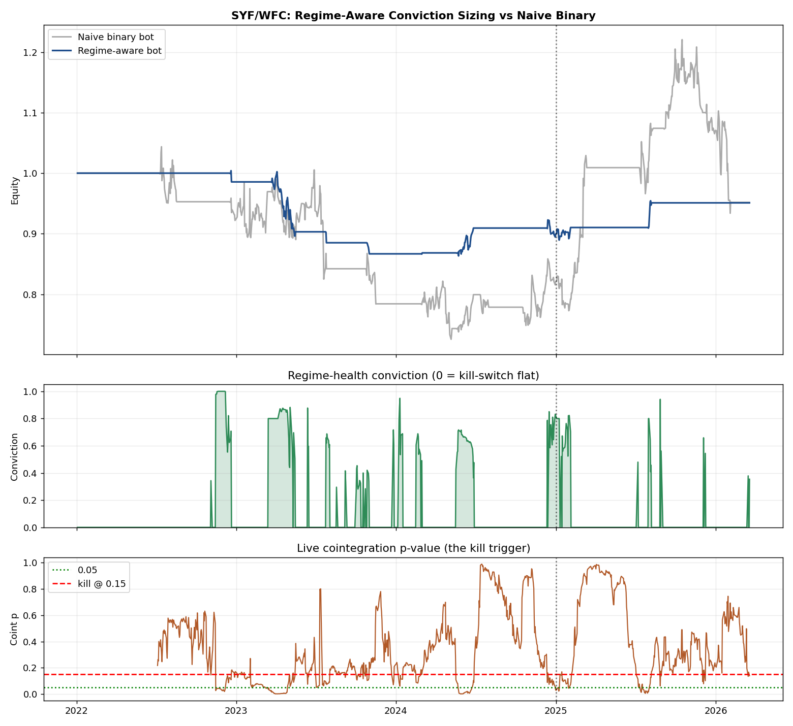

# Regime-Aware Bot — SYF/WFC with Conviction Sizing + Kill-Switch
**Date:** 2026-05-29 · **Pair:** SYF / WFC (consumer lenders) · **Engine:** [src/regime_bot.py](../src/regime_bot.py)

## Idea
The NVDA/TSLA bot died running full size on a relationship that had quietly stopped cointegrating.
This wraps the *same* mean-reversion signal in a live regime-health overlay so the book **sizes
itself to how alive the relationship is**, and **flattens automatically** when cointegration is gone.

**Conviction (0→1, lagged one day, no lookahead)** = `0.5·coint + 0.3·corr + 0.2·half-life` health,
with a **hard kill-switch to flat when rolling cointegration p > 0.15**. Position = signal state ×
conviction. Benchmark = the naive binary version (conviction ≡ 1) on the same pair and costs.

## Result (full sample 2022→2026-03; OOS = 2025→2026-03)

| Metric | Naive binary | **Regime-aware** | Change |
|---|---|---|---|
| Max drawdown | −30.5% | **−14.0%** | **−54% risk** |
| Out-of-sample Sharpe | 0.63 | **0.94** | **+49%** |
| Full-sample Sharpe | 0.04 | −0.21 | — |
| Total return | −4.8% | −4.9% | flat |
| Days deployed | 100% | **~12%** (mean conviction 0.12) | capital freed |

## Read this honestly
- **The win is risk control, not more return.** The overlay halves the drawdown and lifts
  out-of-sample, risk-adjusted quality by ~50% — it stops the bot fighting at full size through dead
  regimes (the exact NVDA/TSLA failure mode).
- **SYF/WFC's edge is concentrated in 2025–26.** The pair barely traded profitably in 2022–24, so the
  overlay correctly sits flat ~88% of the time and full-sample return is ~0. A single pair sized this
  conservatively is **not a standalone business** — it's one sleeve.
- **Therefore: run a portfolio of gated pairs.** Each contributes only when its own cointegration is
  alive; the kill-switch retires any one of them automatically the day it decays. That converts
  "alpha decay" from a three-year drawdown (NVDA/TSLA) into a routine, self-healing rotation.

## How this closes the loop
1. **Gate** at funding ([src/scanner.py](../src/scanner.py)) — only genuinely cointegrated, OOS-validated pairs.
2. **Size** by live regime health (this module) — capital follows conviction, not a binary trigger.
3. **Kill** automatically when cointegration breaks — no three-year bleed, no human in the loop.
